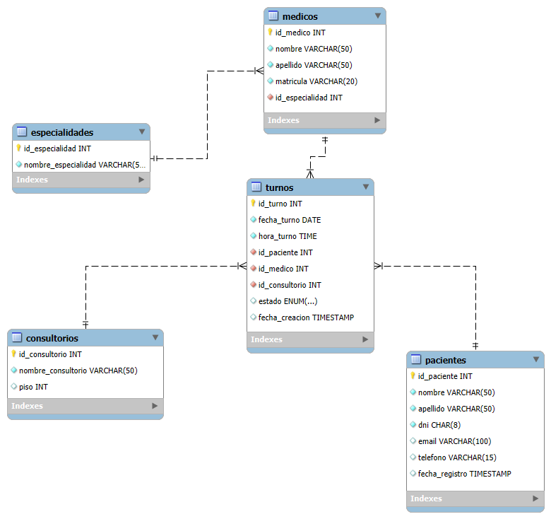

# Proyecto Final – Base de Datos Consultorio Médico

**Alumna:** Micaela Rombolá  
**Fecha:** 12/08/2025  
**Materia:** SQL  

---

## 1. Introducción
El presente trabajo describe el desarrollo de una base de datos relacional destinada a la administración de un consultorio médico.  
El sistema se diseñó para organizar la información de los pacientes, médicos, especialidades, consultorios y turnos, con el objetivo de garantizar la integridad de los datos, optimizar el flujo de trabajo y reducir errores administrativos.  
La base de datos fue concebida teniendo en cuenta criterios de normalización y escalabilidad para adaptarse a futuras necesidades.

---

## 2. Objetivos

### Funcionales
- Permitir el registro, actualización y consulta de pacientes, médicos, especialidades, consultorios y turnos.
- Evitar duplicidades mediante claves únicas en DNI y matrícula profesional.
- Facilitar la búsqueda de turnos filtrando por fecha, médico, especialidad o consultorio.
- Generar estadísticas como cantidad de turnos por especialidad o estado.

### Técnicos
- Implementar claves primarias y foráneas, índices y restricciones para mantener la integridad referencial.
- Diseñar un modelo en tercera forma normal (3FN) para evitar redundancia y mejorar la eficiencia.
- Preparar índices para optimizar consultas sobre campos de búsqueda frecuente.

### Estratégicos
- Servir como base para la incorporación de módulos de facturación, gestión de usuarios o historial médico.
- Facilitar la toma de decisiones basada en datos, a través de reportes claros y confiables.

---

## 3. Situación Problemática
Antes de la implementación, el consultorio gestionaba la información en hojas de cálculo y registros físicos, lo que ocasionaba:
- Pérdida de información por errores humanos o falta de respaldo.
- Asignación duplicada de turnos.
- Datos inconsistentes en nombres, documentos y matrículas.
- Dificultad para acceder al historial de un paciente o consultar la agenda de un médico.

La base de datos propuesta resuelve estas deficiencias mediante relaciones bien definidas, integridad referencial y reglas que evitan inconsistencias.

---

## 4. Modelo de Negocio
El consultorio cuenta con un equipo de médicos, cada uno perteneciente a una especialidad específica.  
Los pacientes solicitan turnos que se asignan a un médico y un consultorio en una fecha y hora determinadas.  
Los turnos pueden tener estado Pendiente, Confirmado o Cancelado.  

Flujo resumido:
1. Solicitud de turno.
2. Asignación de médico, especialidad y consultorio.
3. Confirmación o cancelación.
4. Atención del paciente.
5. Registro y análisis de la información.

---

## 5. Diagrama Entidad-Relación

---

## 6. Listado de Tablas y Campos

| Tabla | Campo | Tipo de dato | Clave | Descripción |
|-------|-------|-------------|-------|-------------|
| Especialidades | id_especialidad | INT | PK | ID de la especialidad |
|  | nombre_especialidad | VARCHAR(50) | UNIQUE | Nombre único de la especialidad |
| Pacientes | id_paciente | INT | PK | ID del paciente |
|  | nombre | VARCHAR(50) |  | Nombre del paciente |
|  | apellido | VARCHAR(50) |  | Apellido del paciente |
|  | dni | CHAR(8) | UNIQUE | Documento Nacional de Identidad |
|  | email | VARCHAR(100) |  | Correo electrónico |
|  | telefono | VARCHAR(15) |  | Teléfono de contacto |
|  | fecha_registro | TIMESTAMP | DEFAULT | Fecha de alta |
| Consultorios | id_consultorio | INT | PK | ID del consultorio |
|  | nombre_consultorio | VARCHAR(50) |  | Nombre identificatorio |
|  | piso | INT |  | Piso del edificio |
| Médicos | id_medico | INT | PK | ID del médico |
|  | nombre | VARCHAR(50) |  | Nombre del médico |
|  | apellido | VARCHAR(50) |  | Apellido del médico |
|  | matricula | VARCHAR(20) | UNIQUE | Matrícula profesional |
|  | id_especialidad | INT | FK | Relación con Especialidades |
| Turnos | id_turno | INT | PK | ID del turno |
|  | fecha_turno | DATE |  | Fecha programada |
|  | hora_turno | TIME |  | Hora programada |
|  | id_paciente | INT | FK | Relación con Pacientes |
|  | id_medico | INT | FK | Relación con Médicos |
|  | id_consultorio | INT | FK | Relación con Consultorios |
|  | estado | ENUM |  | Estado actual |
|  | fecha_creacion | TIMESTAMP | DEFAULT | Fecha y hora de registro |

---

## 7. Abreviaturas de Campos

| Campo | Abrev. | Nombre completo |
|---|---|---|
| id_especialidad | IDES | ID de especialidad |
| nombre_especialidad | NOMESP | Nombre de la especialidad |
| id_paciente | IDP | ID del paciente |
| nombre | NOM | Nombre |
| apellido | APE | Apellido |
| dni | DNI | Documento Nacional de Identidad |
| email | EMAIL | Correo electrónico |
| telefono | TEL | Teléfono |
| fecha_registro | FREG | Fecha de registro |
| id_consultorio | IDC | ID de consultorio |
| nombre_consultorio | NOMC | Nombre del consultorio |
| piso | PISO | Piso |
| id_medico | IDM | ID del médico |
| matricula | MAT | Matrícula profesional |
| fecha_turno | FET | Fecha del turno |
| hora_turno | HOT | Hora del turno |
| estado | EST | Estado del turno |
| fecha_creacion | FCRE | Fecha de creación |

---

## 8. Script SQL
Archivo: `ConsultorioMedico_completo.sql`

[Enlace al script](ConsultorioMedico_completo.sql)

---

## 9. Repositorio en GitHub
🔗 **[Enlace pendiente de agregar]**